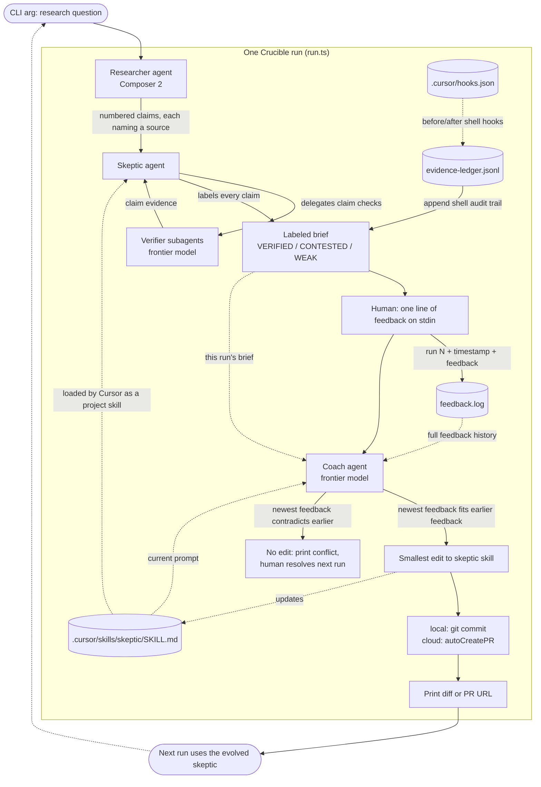

# Crucible

A research system where a skeptic agent's prompt evolves through human
feedback, with the evolution tracked in git.

Each run makes three role-routed agent calls (researcher, skeptic, coach) via
`@cursor/sdk`. The skeptic can fan out to verifier subagents, and the coach can
run locally or in cloud PR mode.

1. **Researcher** turns your question into sourced claims.
2. **Skeptic** (a project skill at `.cursor/skills/skeptic/SKILL.md`) labels
   each claim VERIFIED / CONTESTED / WEAK. It can delegate individual claims to
   verifier subagents.
3. The labeled brief prints to the terminal, then you give one line of
   feedback (logged to `feedback.log`). A project hook writes shell commands to
   `.cursor/evidence-ledger.jsonl`, and that ledger is appended to the brief.
4. **Coach** proposes the smallest edit to the skeptic skill that addresses the
   newest feedback without violating earlier feedback. Local mode commits the
   skill edit to git; cloud mode opens a PR with `autoCreatePR`.

## How a run flows



The dotted edges into the coach are its three inputs; the dotted edge out of
the edit is the core loop: each run's feedback permanently reshapes the
skeptic that the next run will use, one git commit at a time.

## Usage

Node.js 22+.

```bash
pnpm install
echo 'CURSOR_API_KEY=crsr_...' > .env   # cursor.com/dashboard -> Integrations
pnpm dev "What is known about the health effects of intermittent fasting?"
```

(`CURSOR_API_KEY` exported in your shell also works; `.env` is gitignored.)

Role model defaults:

```bash
CRUCIBLE_RESEARCHER_MODEL=composer-2
CRUCIBLE_SKEPTIC_MODEL=gpt-5.5
CRUCIBLE_VERIFIER_MODEL=gpt-5.5
CRUCIBLE_COACH_MODEL=gpt-5.5
```

Run the coach as a cloud agent that opens a PR instead of committing locally:

```bash
CRUCIBLE_COACH_RUNTIME=cloud pnpm dev "Does remote work improve productivity?"
```

Watch the skeptic evolve:

```bash
git log --oneline -- .cursor/skills/skeptic/SKILL.md
```
