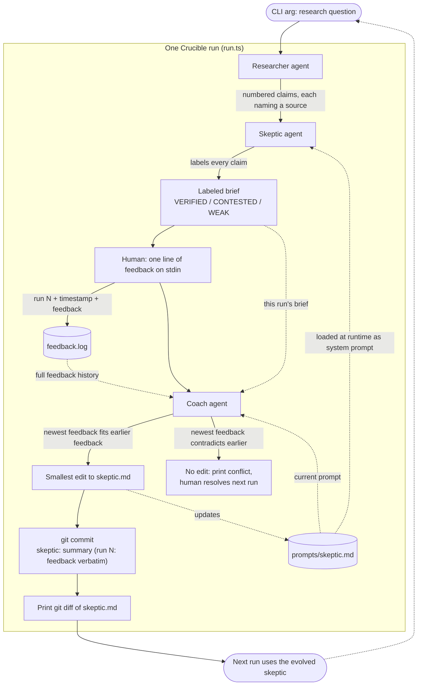

# Crucible

A research system where a skeptic agent's prompt evolves through human
feedback, with the evolution tracked in git.

Each run makes three sequential local agent calls (researcher, skeptic, coach)
via `@cursor/sdk`:

1. **Researcher** turns your question into sourced claims.
2. **Skeptic** (system prompt loaded from `prompts/skeptic.md`) labels each
   claim VERIFIED / CONTESTED / WEAK.
3. The labeled brief prints to the terminal, then you give one line of
   feedback (logged to `feedback.log`).
4. **Coach** proposes the smallest edit to `prompts/skeptic.md` that addresses
   the newest feedback without violating earlier feedback, and the edit is
   committed to git. Conflicting feedback is surfaced instead of applied.

## How a run flows



The dotted edges into the coach are its three inputs; the dotted edge out of
the edit is the core loop: each run's feedback permanently reshapes the
skeptic that the next run will use, one git commit at a time.

## Usage

Node.js 22+.

```bash
pnpm install
echo 'CURSOR_API_KEY=crsr_...' > .env   # cursor.com/dashboard -> Integrations
pnpm dev "What is known about the health effects of intermittent fasting?"
```

(`CURSOR_API_KEY` exported in your shell also works; `.env` is gitignored.)

Optional: `CURSOR_MODEL` overrides the model (default `composer-2.5`).

Watch the skeptic evolve:

```bash
git log --oneline -- crucible/prompts/skeptic.md
```
